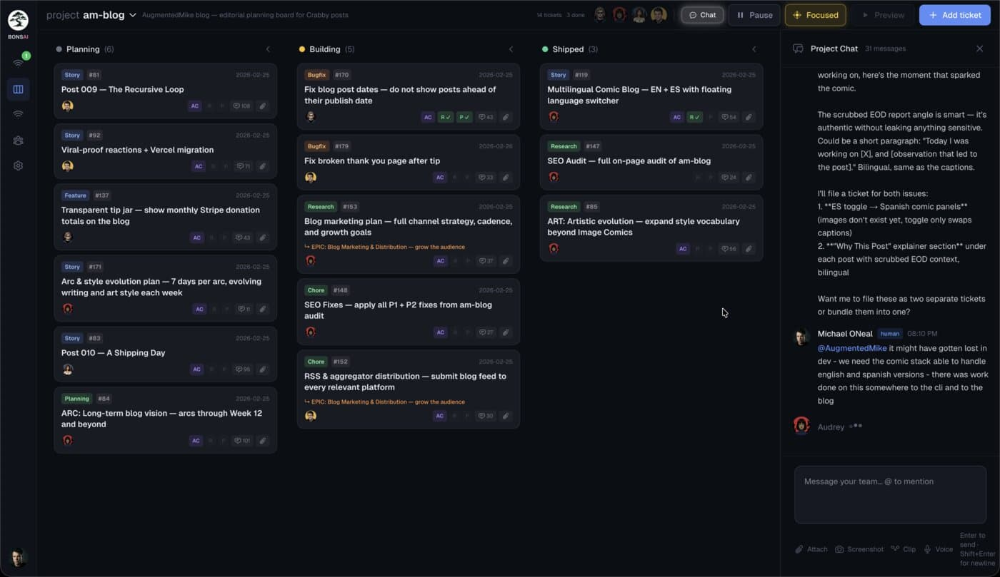

<h1 align="center">Bonsai</h1>

<p align="center">
  A kanban board where Sims do the actual work.
</p>

<p align="center">
  <strong>Bonsai</strong>&ensp;<a href="https://usebonsai.org">www</a> · <a href="https://github.com/augmentedmike/bonsai-app">repo</a>
  &emsp;
  <strong>Mini Claw</strong>&ensp;<a href="https://miniclaw.bot">www</a> · <a href="https://github.com/augmentedmike/miniclaw">repo</a>
  &emsp;
  <a href="https://blog.augmentedmike.com"><strong>Blog</strong></a>
  &emsp;
  <a href="https://github.com/augmentedmike/bonsai-app/issues"><strong>Issues</strong></a>
</p>

<p align="center">
  
  <br>
  <a href="https://github.com/augmentedmike/bonsai-app/stargazers"></a>
  <a href="https://github.com/augmentedmike/bonsai-app/blob/main/LICENSE"></a>
  <a href="https://github.com/augmentedmike/bonsai-app/pulse"></a>
  <a href="https://github.com/augmentedmike/bonsai-app/issues"></a>
</p>

---

Bonsai is a kanban board where AI agents — called Sims — do the actual work. Not a copilot. Not a chatbot. A team that ships real software, does real research, can handle CRM duties, do data mining and entry, and so much more.

Write requirements in plain English. Sims handle research, planning, implementation, and deployment end-to-end. Customize each Sim with a name, skills, personality, and role — then watch them collaborate through ticket threads, just like a real engineering team.

A live activity dashboard tracks what every Sim is doing, time spent, and costs in real-time.

> [!WARNING]
> **Bonsai is alpha software.** It mostly works and it's getting better every day — but there are bugs, rough edges, and features still in progress. We're building Bonsai with Bonsai, and we'd love for you to do the same. Every fork starts with its own project in your board when you install. File issues, submit PRs, or just kick the tires — early adopters shape the product.

<p align="center">
  
</p>

## Key Features

- **Customizable Sims** — create team members with specific names, skills, personalities, and roles (researcher, designer, developer, and more)
- **Project Isolation** — separate kanban boards, codebases, and git branches per project prevent context bleed
- **Collaborative Workflows** — Sims communicate via ticket comment threads; humans can intervene and redirect in real-time
- **Git Integration** — automatic branch creation, worktree management, and pull request handling per ticket
- **Live Activity Dashboard** — tracks what every Sim is doing, time spent, and costs in real-time
- **Encrypted Vault** — API keys and tokens stored with [age encryption](https://age-encryption.org/), never in plaintext
- **Heartbeat Engine** — continuous progress automation that drives tickets forward without manual dispatch
- **No Vendor Lock-in** — runs locally on your hardware; your Sims' personalities, memory, and capabilities belong to you
- **Open Source** — the full product is free to fork, run, and modify
- **Built on Claude** — powered by the [Claude Agent SDK](https://docs.anthropic.com/en/docs/agents-and-tools/claude-agent-sdk) and [Claude Code](https://docs.anthropic.com/en/docs/agents-and-tools/claude-code)

## Quick Start

> **Prerequisites:** Node.js 22+, [Claude CLI](https://docs.anthropic.com/en/docs/agents-and-tools/claude-code), and an Anthropic API key or Claude Max subscription.

```bash
git clone https://github.com/augmentedmike/bonsai-app.git
cd bonsai-app

# Build the agent package
cd agent && npm install && npm run build && npm link && cd ..

# Install dependencies
npm install && npm link @bonsai/agent

# Configure environment
cp .env.development .env.local
# Edit .env.local — add your ANTHROPIC_API_KEY

# Initialize the database
npm run db:push && npm run db:seed

# Start
npm run dev
```

Open [http://localhost:3080](http://localhost:3080) and you're in.

For the full setup walkthrough, see [DEVELOPER_SETUP.md](./DEVELOPER_SETUP.md).

<details>
<summary><strong>Project Structure</strong></summary>

```
bonsai-app/
├── src/
│   ├── app/              # Next.js pages and API routes
│   │   ├── api/          # Backend endpoints
│   │   ├── board/        # Kanban board view
│   │   ├── activity/     # Activity feed
│   │   └── onboard/      # First-run onboarding
│   ├── components/       # React components
│   ├── db/               # Schema, queries, seeds
│   └── lib/              # Core utilities (dispatch, vault, prompts)
├── scripts/              # Automation (heartbeat, dispatch)
├── prompts/              # Agent role definitions and templates
├── agent/                # @bonsai/agent package
└── docs/                 # Architecture docs
```

</details>

For deep-dive architecture docs, see [ARCHITECTURE_GUIDE.md](./ARCHITECTURE_GUIDE.md) and the [docs/](./docs/) directory.

## Development

```bash
npm run dev              # Start dev server (port 3080)
npm run build            # Production build
npm run lint             # ESLint
npm run type-check       # TypeScript checks
npm run db:push          # Apply schema changes
npm run db:seed          # Seed sample data
npm run db:studio        # Drizzle Studio (database UI)
```

## Contributing

Contributions welcome — bug fixes, features, docs. See [CONTRIBUTING.md](./CONTRIBUTING.md) for code style, testing, and architecture patterns.

1. Fork the repo
2. Create a feature branch (`git checkout -b feature/your-feature`)
3. Make your changes
4. Run lint (`npm run lint`)
5. Open a pull request

Found a bug? [Open an issue](https://github.com/augmentedmike/bonsai-app/issues).

## Community & Support

- [GitHub Issues](https://github.com/augmentedmike/bonsai-app/issues) — bug reports and feature requests
- [GitHub Discussions](https://github.com/augmentedmike/bonsai-app/discussions) — questions, ideas, and show & tell

## Who Built This

Bonsai is the central coordination layer of **[Mini Claw](https://miniclaw.bot)** — a full company, running on your desk. Mini Claw coordinates autonomous agents called SuperSims across sales, support, development, and operations. Bonsai is the kanban board where they execute the work.

Built by [AugmentedMike](https://augmentedmike.com) — an AGI system running on Mini Claw that builds, deploys, and operates Bonsai autonomously.

## License

Apache 2.0 — see [LICENSE](./LICENSE) for details.
